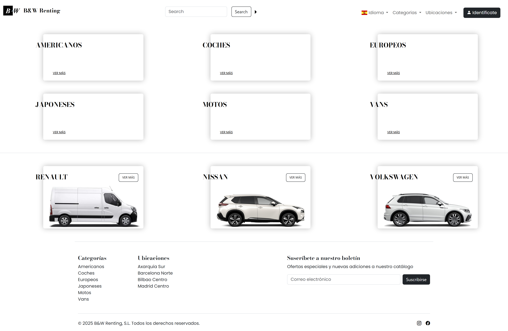

# Renting JS Exercise

JavaScript exercise part of my higher degree on web app development.

A lightweight web application intended to run under XAMPP (Apache + PHP). This README provides quick setup, usage, and development notes.

---

## Requirements
- XAMPP (Apache, PHP). Tested with PHP 7.4+.

---

## Installation
Just copy the project into XAMPP htdocs:
    - Windows: `C:\xampp\htdocs\DWEC07`
    - Or clone into that folder: `git clone <repo-url> C:\xampp\htdocs\DWEC07`

---

## Run
1. Start Apache from the XAMPP Control Panel.
2. Open the app in a browser:
    - http://localhost/DWEC07/ or http://127.0.0.1/DWEC07/
3. To run as administrator the credentials are:
    - **User:** admin
    - **Password:** admin 

---

## Project structure
- `index.html` — application entry point
- `vehicle.html` — used to open vehicles in a new window
- `general.css` — Aditional styles to bootstrap
- `js/` — JS files
    - `js/data/` — JSON files with all catalog data
- `img/` — images
- `Backup/` — Backups that can be used as data-sources

---

## Description

This project have a lot of room to improve, but it was developed as a learning exercise among severak others — thank you for your understanding.

When you first open the main page, you will see a headaer, six categories, a separator line and three random vehicles.

Each vehicle belongs to one or two categories and has an assigned location. You can click on them view more details, open them in a new page and navigate through related categories and locations.

On category and location pages you can enable **theather mode** by clicking the **Modo teatro** button. This open a modal with a one-directional slider showing all related vehicles.

In the header you will find the **search bar** where you can type any brand or model name, and optionally filter by price or rental status.

All vehicles, categories and locations are loaded from the `data.json` file in the data directory.

One of the most interesting parts of the exercise is the posibilty of logging in as administrator to unlock more functions. You can do this by clickcling in the "Identificate" button in the right side of the header. The credentials to log in as administrator are user "admin" and password "admin".

Once logged in, you’ll have access to:
- The **⭐ Favorites** button, showing all selected vehicles.
- The **Administration** menu, where you can manage all items.

From there, you can create vehicles, categories, and locations, and generate backups. Backup files are located in the `Backup/` folder and can be used as data-source by copiyng one into `js/data/` directory and renaming it to data.json, replacing the original.

Thank you for your interest in my work!